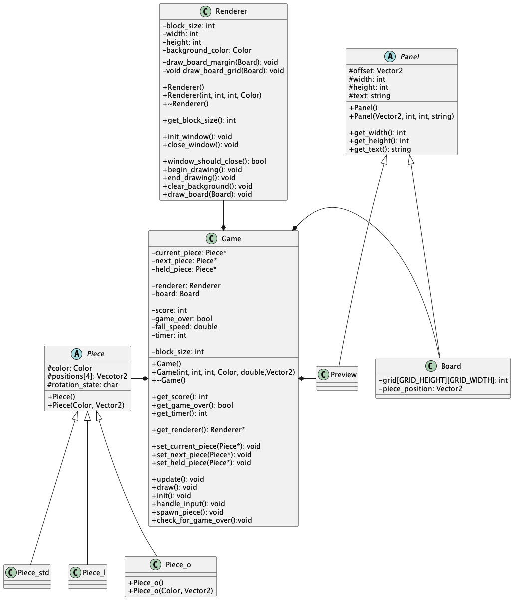

# Tetris

## Introduction

This is an object oriented implementation of the Tetris game built using [Raylib](https://www.raylib.com/), a simple and easy-to-use library for game programming. It mainly focuses on utilizing OOP concepts such as inheritance and polymorphism. 

## Features

*To be updated as they get implemented*

## Installation

### Prerequisites

- A c++ compiler (preferrably gcc)
- Cmake 

> *Note*: If you do not have cmake installed, [here](./cmake_guide.md) is a quick installation guide.

### Steps

1. Clone the repository:
```{bash}
git clone https://github.com/Alex-Benitez16/tetris.git
cd tetris
```

2. Build the game with cmake:
```{bash}
cmake -B build
cmake --build build
cd build
```

3. Run the game:
```{bash}
./game # Or its equivalent on your platform
```

> *Note*: The game is build within the `build` directory, but it may be nested within more files depending on the platform. Check the make logs to see exactly where it is.

## UML Analysis



- **Game**: Is the main class, and almost everything is composed to it. It holds all the game object and state, and has the three main functions `init()`, `update()`, and `draw()`.
- **Renderer**: Here are encapsulated all the functions and methods that deal with the rendering of the game using Raylib.
- **Pice**: Is the base class for the three kinds of pieces, `Piece_o`, `Piece_l`, and `Piece_std`. Their differences lie in the rotation methods. 
- **Board**: Contains an array with all occuppied cells. It deals with all the game logic regarding the main board.
- **Preview**: Is the class that manages the extra windows, such as the hold window and the next pieces window. 

## Controls

*To be defined*
